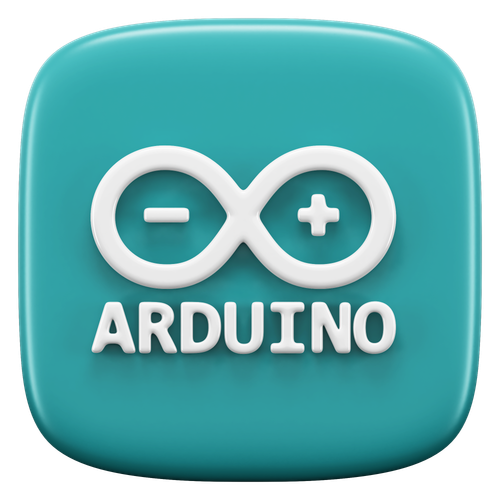

<h1 align="center">
    
</h1>

 </a>

<h3 align="center">Undergraduate Software Engineer | Specializing in Java and Application Development</h3>

  

- 🌱 I’m currently learning **GUI Development in Java, Data Structures, and Algorithms**

- 💬 Ask me about **Java Programming, Problem Solving on HackerRank, GUI Development, Writing Clean Code and Optimizing Algorithms**

- 📫 How to reach me **rasheen27392@gmail.com**

## <h3 align="center">My Skills</h3>

   
   
  
  
   
   
  
  
  

## <h3 align="center">Connect With Me</h3>

    <picture align="center">
      <source media="(prefers-color-scheme: dark)" srcset="https://raw.githubusercontent.com/Niefee/niefee/master/assets/github-contribution-grid-snake.svg">
      <source media="(prefers-color-scheme: light)" srcset="https://raw.githubusercontent.com/Niefee/niefee/master/assets/github-contribution-grid-snake.svg">
      
    </picture>

   
  
